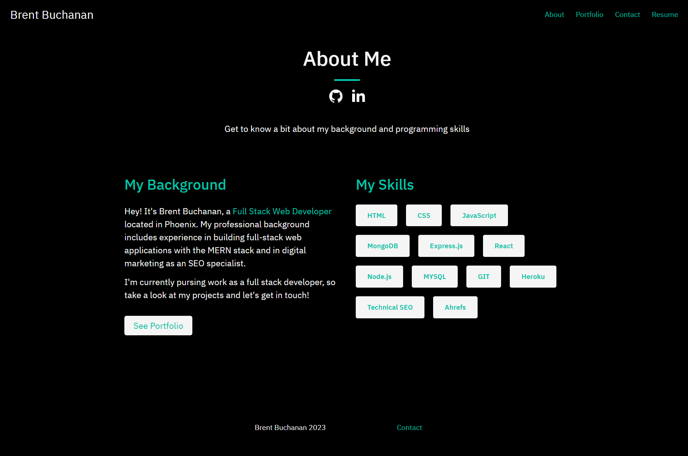
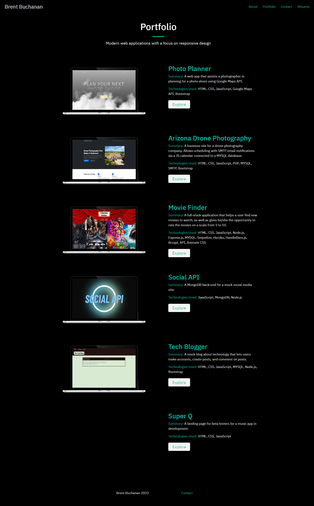
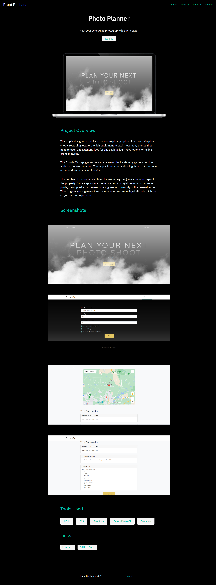
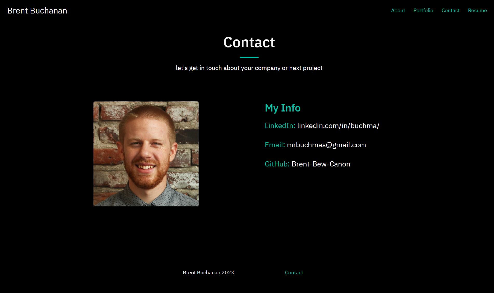
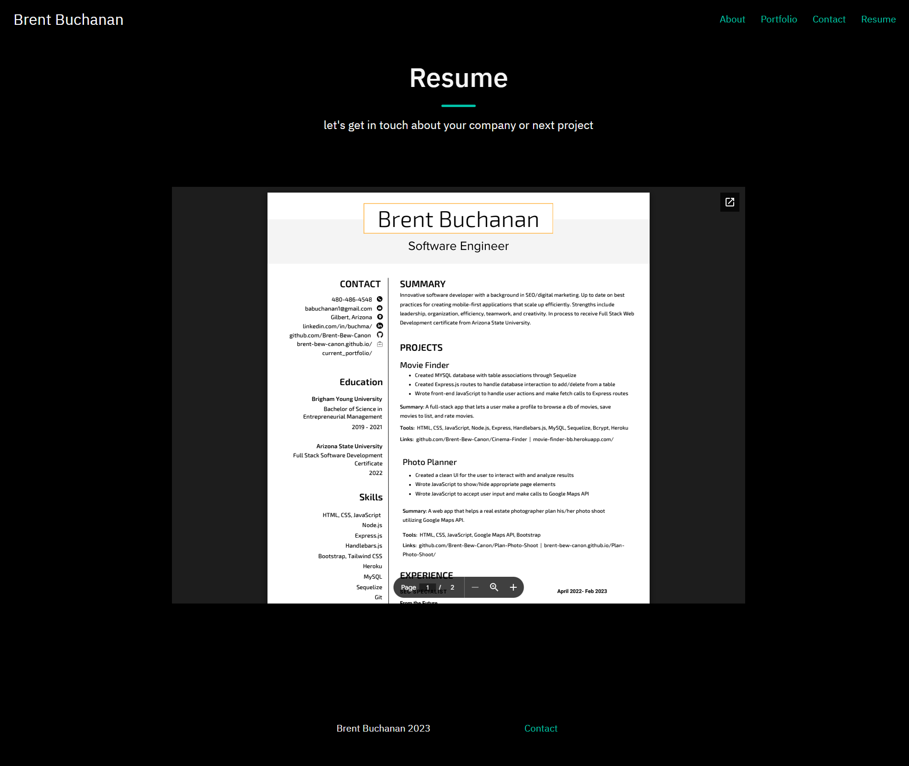

# Brent's React Portfolio

## Description
This is my current portfolio, written as a single page web application in React. You can browse my recent projects, get to know a little bit about my background, checkout my LinkedIn and Github, and contact me via email.

## License
Licensed under the The MIT License    
          

## Live Link
https://brent-bew-canon.github.io/react-portfolio/

## Screenshots                
 ### About Me Section 
     
 ### Portfolio Section                               
               
          
  ### Project Section                    
                 
                
  ### Contact Section 
                      
         
  ### Resume Section      

                        
       

